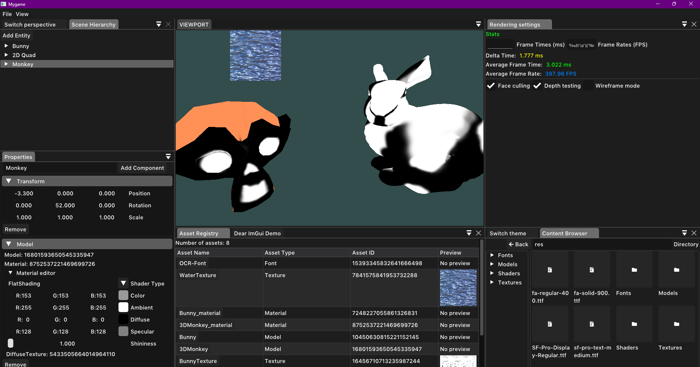

+++
author = "Paul Tomás"
title = "Game Engine"
date = "2024-03-11"
description = "Sample article showcasing the engine I'm working on"
categories = [
    "GameDev",
    "C/C++",
    "Projects",
]
image = "Banner.svg"
+++

## Description & Why?
- The engine is designed support both 2D and 3D rendering through OpenGL, with a responsive and modern looking editor interface. It's cross platform, running on both Windows and Linux. I try to rely as less as possible on platform-specific code. Currently, the engine supports serialization, basic rendering and asset management.
- The main purpose of this engine is to teach myself about game engine architecture and take a look at how they work under the hood.

## Screenshots

</img>

## Main features
**- Works on windows and linux**

**- Editor:**
- A responsive UI made with dear ImGui
- Like with any modern application, you can dock and arrange windows to your liking
- The scene hierarchy panel integrates seamlessly with the ECS
- Drag and drop features

**- Graphics:**
- OpenGL based rendering
- 2D and 3D renderer
- Material system

**- ECS:**
- Custom ECS (Entity Component System) framework
- Cache friendly implementation

**- Serialization:**
- The entire state of the application is written to disk in yaml format
- Projects, Scenes and Asset metadata can be loaded again to store the progress

## Technical details
**- Build system:**
- [Premake5](https://github.com/premake/premake-core) is used to generate project files on windows and linux

**- Libraries used:**
- [glm](https://github.com/g-truc/glm)
- [assimp](https://github.com/Politofr09/glfw)
- [imgui](https://github.com/ocornut/imgui)
- [glfw](https://github.com/Politofr09/glfw)
- [glew](https://github.com/nigels-com/glew)
- [yaml-cpp](https://github.com/jbeder/yaml-cpp)