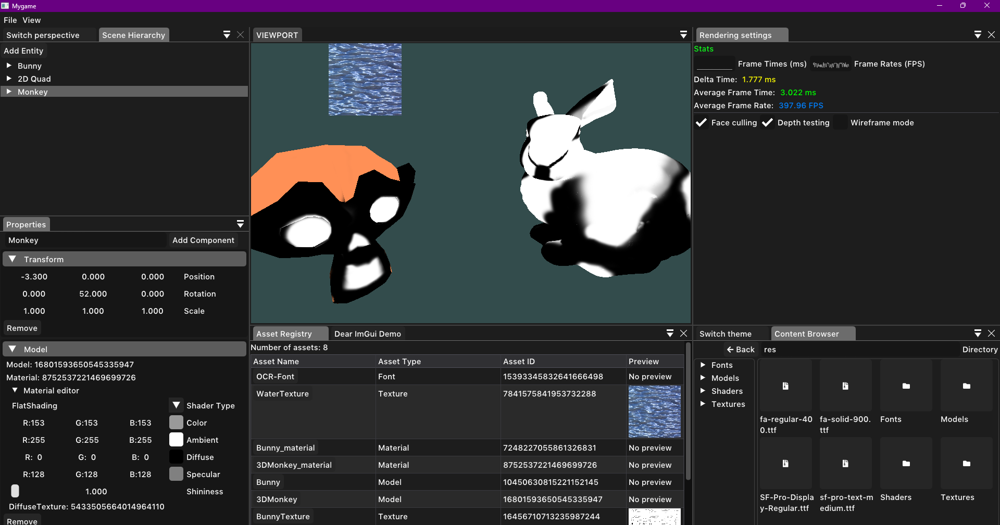

+++
author = "Paul Tomás"
title = "Motor de videojuegos"
date = "2024-03-11"
description = "Artículo presentando el motor en el que estoy trabajando"
categories = [
    "Desarollo de videojuegos",
    "C/C++",
    "Proyectos",
]
image = "Banner.png"
+++

## Descripción y por qué?
- El motor está diseñado para soportar renderizado 2D y 3D a través de OpenGL, con una interfaz de edición moderna y responsive. Es multiplataforma y funciona tanto en Windows como en Linux. Intento depender lo menos posible de código específico de plataformas. Actualmente, el motor admite serialización, renderizado básico y gestión de assets.
- El objetivo principal de este motor es aprender sobre la arquitectura de los motores de juegos y ver cómo funcionan en en realidad.

## Capturas

</img>

## Funciones principales
**- Funciona en windows y en linux**

**- Editor:**
- Interfaz de usuario hecha con ImGui
- Al igual que con cualquier aplicación moderna, puedes acoplar y organizar las ventanas
- El panel de jerarquía de escenas se integra perfectamente con el ECS
- Funciones de arrastrar y soltar

**- Gráficos:**
- Renderizado basado en OpenGL
- Renderizador 2D y 3D
- Sistema de materiales

**- ECS:**
- Librería ECS (Entity Component System) personalizada
- Implementación que utiliza la caché

**- Serialización:**
- Todo el estado de la aplicación se escribe en el disco en formato yaml
- Los proyectos, las escenas y los metadatos de los assets se pueden volver a cargar para almacenar el progreso

## Detalles técnicos
**- Build system:**
- [Premake5](https://github.com/premake/premake-core) se usa para generar archivos de proyecto para windows y linux

**- Librerías usadas:**
- [glm](https://github.com/g-truc/glm)
- [assimp](https://github.com/Politofr09/glfw)
- [imgui](https://github.com/ocornut/imgui)
- [glfw](https://github.com/Politofr09/glfw)
- [glew](https://github.com/nigels-com/glew)
- [yaml-cpp](https://github.com/jbeder/yaml-cpp)