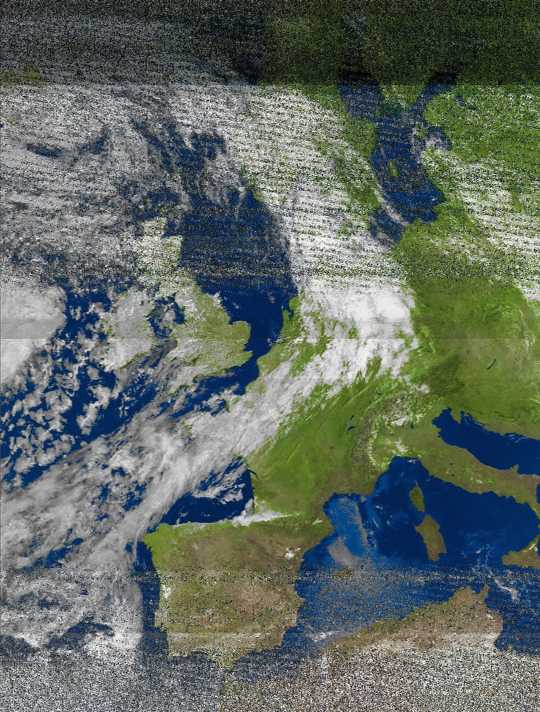
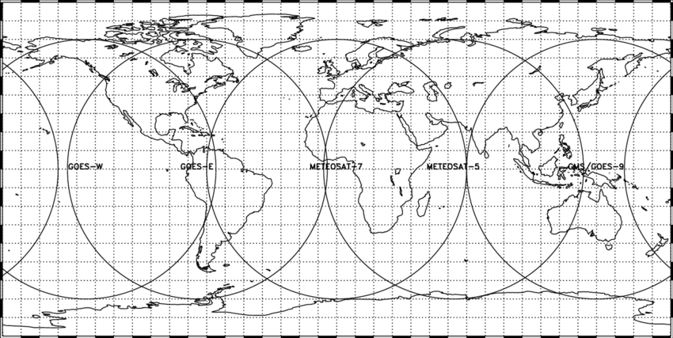

+++
author = "Paul Tomás"
title = "Weather images directly from space"
date = "2024-06-11"
description = "How I obtained images directly from NOAA and Meteor m2 satellites"
categories = [
    "Messing around",
    "Projects",
]
image = "featured.jpg"
+++

# Intro
This summer I got into ham radio with the [RTL SDR](https://www.rtl-sdr.com) dongle that turns your pc into a radio. With this cheap inexpensive dongle, you can listen to aircraft, listen to the local radio and, most importantly, you can listen to weather satellites.

# Story
When I first heard about this I knew that I had to try it. There's even people who [receive images from the ISS!](https://www.rtl-sdr.com/tag/sstv/)
When the antenna and the sdr dongle arrived, I quickly prepared and waited for the satellite to pass.

As you can see  this image is completely trash, because I tried receiving it from my balcony. I quickly discovered that in order to have great signal, I need open sky.

After other failed attempts, I changed my spot and went to the countryside. This time, I got a pretty good image from NOAA 15:

I will always remember how happy I was. I just received an image from a satellite! The rest of the summer I tried listening to more satellites and trying to have longer passes (longer images). With my current hardware, there are only NOAA and Meteor-M2 satellites that I can hear. There are also [geostationary satellites](https://en.wikipedia.org/wiki/Geostationary_orbit), but I would need a dish antenna. This is because geostationary satellites are way further away from earth than [polar-orbitting satellites](https://en.wikipedia.org/wiki/Polar_orbit) (like NOAA and Meteor-M2).

Not only that but in europe the geostationary satellite (Meteosat) that we have is encrypted, and it's impossible to get anything from there.

# The process
Let's talk about how this is even possible:

Polar-orbiting satellites orbitate north-south and if we add the earth's rotation we get this kind of movement

To receive the signal from the satellite, the V-dipole antenna (120º angle) facing south or north.

On the software side, we need to use an sdr application like [Sdr#](https://airspy.com) or [Sdr++](https://www.sdrpp.org).
This is where you **interface with the sdr dongle**, and where you tune the frequency.
I chose Sdr++ because it works great with linux and that's what my laptop is running.

Additionally, you need some kind of program that takes the signal recorded and decodes it into an image. For **NOAA APT**, wxtoimg or noaa-apt work well.

However, I found it more comfortable to use [Satdump](https://github.com/SatDump/SatDump). It's interface may look similar to sdr++ because they both use ImGui *(big fan!).* But satdump is more specialized in decoding satellites. Note that everyone uses a different physical setup (antenna, dongle, laptop) and everyone has different software preferences.

When it comes to decoding satellite signals, the majority of satellites use digital encoding with error correction and higher resolution. This is what the Meteor series use. However there is also analog modulation used by NOAA 15, 18 and 19. Although they also transmit digital on other bands, I can't listen to them with my antenna.

The reason we only can listen to these satellites is because they transmit images on the **137 mhz** band, and that's what our antenna is tuned to. You may ask yourself, "But why do so few satellites operate on these bands?" Well, it's because it's a pretty low band, meaning other ground stations can interfere with the signal.

We also need to cover how to know when are the satellites going to pass over our zone. For that I use either [gpredict](https://oz9aec.dk/gpredict/) or [n2yo](https://n2yo.com). These programs are also very useful for knowing if the pass is going to be good or not and not waste your time.

We can finally take a look at how the image is encoded and decoded. Assuming we got a good signal with not much interference, it should be great. Actually, for both digital and analog modulation, the image is sent by channels (r, g, b). **NOAA APT** only sends 2 channels, but Meteor sends 3 channels, which gives more color accuracy. Also, meteor images give more detail *(1pixel / km)* than **NOAA**. 

The advantage with **NOAA APT** is that even if there is not a good signal, you are going to get some image with more or less noise. Meteor digital signal on the other hand uses error correction to try to solve interference, but when it fails, you get a black line.

Let's take a look at the best images I took this summer!

Meteor-M2:
On this one we can clearly see [Arcachon](https://www.google.com/maps/place/44°39'38.6"N+1°10'06.5"W/@44.6834736,-1.2139958,50378m/data=!3m1!1e3!4m4!3m3!8m2!3d44.66072!4d-1.16848!5m1!1e4?entry=ttu&g_ep=EgoyMDI0MTExMy4xIKXMDSoASAFQAw%3D%3D) in France. (Actually the image is compressed and smaller details get lost. This shows how much detail gives meteor)

This one is also pretty good. You can see Istambul and if you look closely on France, you can even see a gray patch where Paris is located!

Now let's take a look at the *longest NOAA image I've ever taken*:
We can see from Groenland to the Canary islands! 

