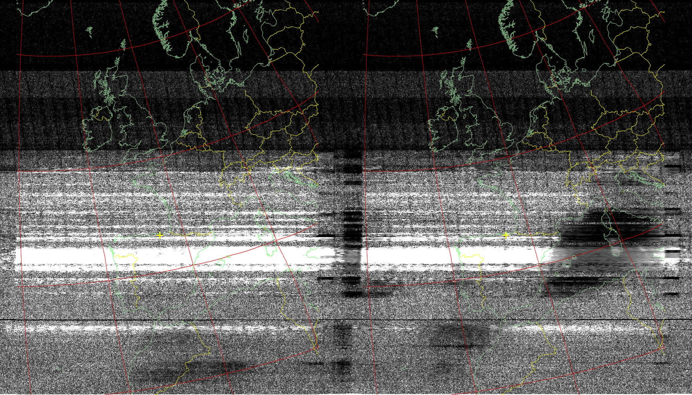
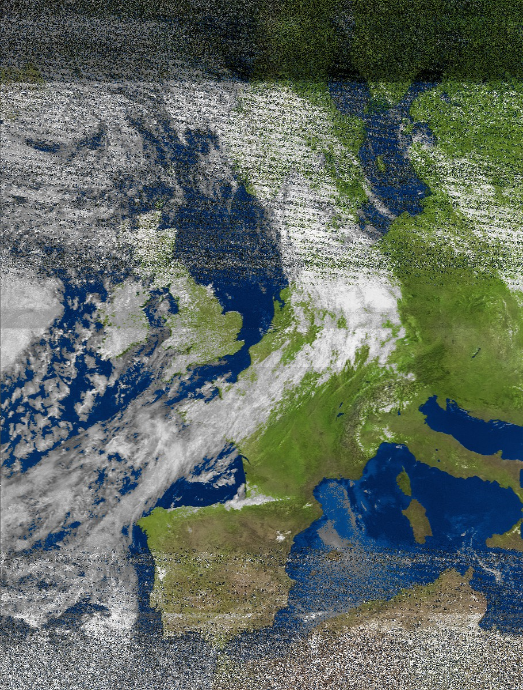
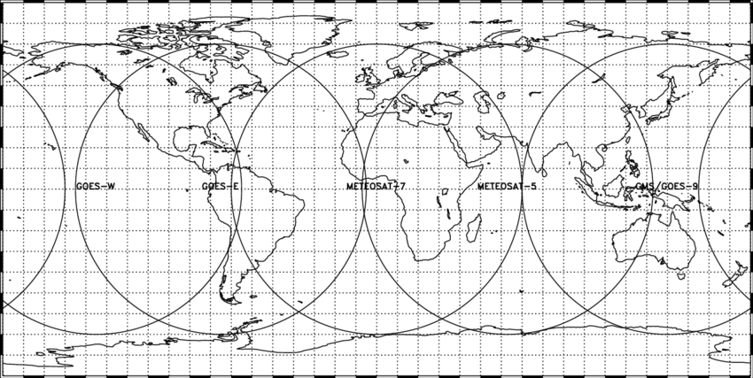
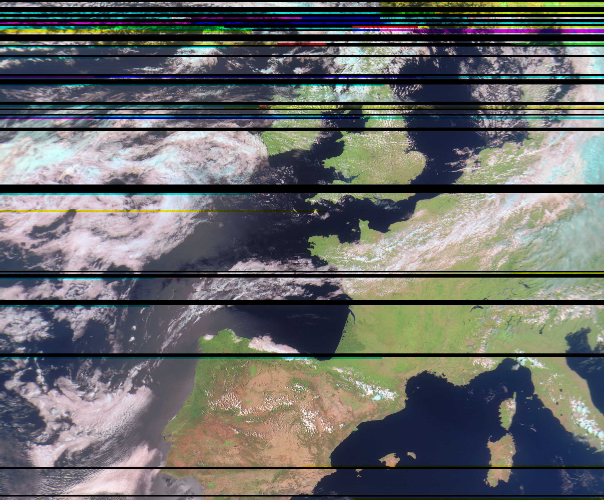
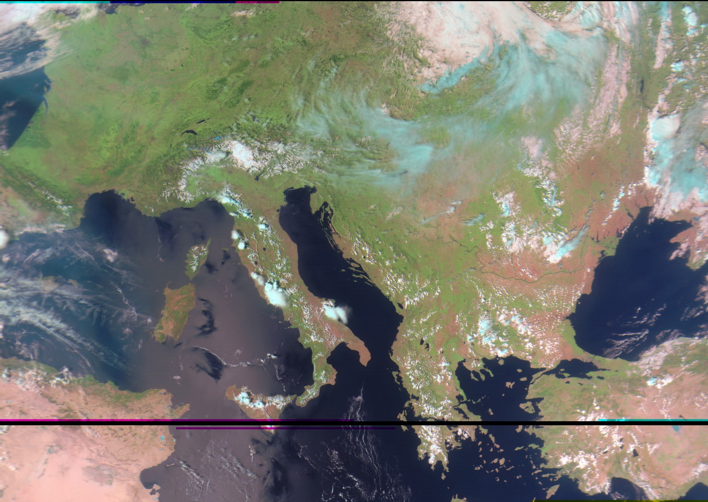
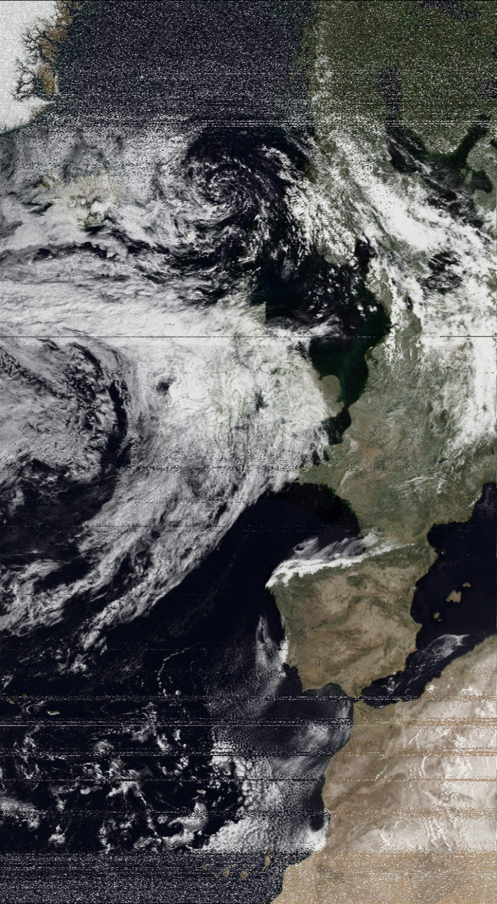

+++
author = "Paul Tomás"
title = "Imágenes meteorológicas desde satélites"
date = "2024-06-11"
description = "Cómo recibí imágenes directamente desde el espacio"
categories = [
    "Trasteando",
    "Proyectos",
]
image = "featured.jpg"
+++

# Introducción
Este verano me adentré en la radioafición con el [RTL SDR](https://www.rtl-sdr.com) que convierte tu PC en una radio. Con este adaptador barato y económico, puedes escuchar aviones, la radio local y, lo más importante, puedes escuchar satélites meteorológicos.

# Historia
Cuando escuché hablar de esto por primera vez, supe que tenía que probarlo. ¡Incluso hay personas que [reciben Imágenes desde la ISS!](https://www.rtl-sdr.com/tag/sstv/)
Cuando llegaron la antena y el adaptador sdr, me preparé rápidamente y esperé a que pasara el satélite para poder intentarlo.

Como podrás ver, esta imagen no vale para nada, porque intenté recibirla desde mi balcón. Rápidamente descubrí que para tener una buena señal, necesito cielo abierto.

Después de otros intentos fallidos, cambié de lugar y me fui al campo. Esta vez, obtuve una imagen bastante buena de NOAA 15:

Siempre recordaré lo feliz que estaba. ¡Acabo de recibir una imagen directamente desde un satélite! El resto del verano intenté escuchar más satélites y tratar de recibir imágenes más largas. Con mi hardware actual, solo puedo escuchar a los satélites NOAA y Meteor-M2. También hay [satélites geoestacionarios](https://en.wikipedia.org/wiki/Geostationary_orbit), pero necesitaría una antena parabólica. Esto se debe a que los satélites geoestacionarios están mucho más lejos de la Tierra que los [satélites de órbita polar](https://en.wikipedia.org/wiki/Polar_orbit) (como NOAA y Meteor-M2).

No sólo eso sino que en Europa el satélite geoestacionario (Meteosat) que tenemos está encriptado y es imposible obtener nada desde allí.

# El proceso
Vamos a ver como esto es posible.

Los satélites en órbita polar orbitan de norte a sur y si le sumamos la rotación de la Tierra obtenemos este tipo de movimiento:

Para recibir la señal del satélite, la antena en forma de V (ángulo de 120º) debe estar orientada al sur o al norte.

En cuanto al software, necesitamos usar una aplicación SDR como [Sdr#](https://airspy.com) o [Sdr++](https://www.sdrpp.org).
Aquí es donde **se interactúa con el dongle SDR** y donde se sintoniza la frecuencia.
Elegí Sdr++ porque funciona muy bien con Linux y es lo que tengo en mi portátil.

Además, necesitas algún tipo de programa que tome la señal grabada y la decodifique en una imagen. Para **NOAA APT**, wxtoimg o noaa-apt funcionan bien.

Sin embargo, me resultó más cómodo usar [Satdump](https://github.com/SatDump/SatDump). Su interfaz puede parecer similar a la de sdr++ porque ambos usan ImGui (¡soy un gran admirador!). Pero satdump está más especializado en decodificar satélites. Ten en cuenta que todos usan una configuración física diferente (antena, adaptador, PC) y todos tienen diferentes preferencias de software.

En lo que se refiere a la decodificación de señales satelitales, la mayoría de los satélites utilizan codificación digital con corrección de errores y mayor resolución. Esto es lo que utiliza la serie Meteor. Sin embargo, también existe modulación analógica utilizada por NOAA 15, 18 y 19. Aunque también transmiten digitalmente en otras bandas, no puedo escucharlos con mi antena.

La razón por la que solo podemos escuchar estos satélites es porque transmiten imágenes en la banda de **137 mhz**, y es en esa banda en la que está sintonizada nuestra antena. Puede que te preguntes: "¿Pero por qué tan pocos satélites operan en estas bandas?" Bueno, es porque es una banda bastante baja, lo que significa que otras estaciones terrestres pueden interferir con la señal.

También tenemos que ver cómo saber cuándo van a pasar los satélites por nuestra zona. Para eso utilizo [gpredict](https://oz9aec.dk/gpredict/) o [n2yo](https://n2yo.com). Estos programas también son muy útiles para saber si el satélite va a estar un buen rato en el cielo o si no.

Finalmente podemos echar un vistazo a cómo se codifica y decodifica la imagen. Suponiendo que tengamos una buena señal sin muchas interferencias, no debería de haber problemas. En realidad, tanto para la modulación digital como para la analógica, la imagen se envía por canales (r, g, b). **NOAA APT** solo envía 2 canales, pero Meteor envía 3 canales, lo que da más precisión de color. Además, las imágenes de Meteor dan más detalles *(1 píxel / km)* que **NOAA**.

La ventaja de **NOAA APT** es que incluso si no hay una buena señal, obtendrás una imagen con más o menos ruido. La señal digital de Meteor, por otro lado, utiliza corrección de errores para intentar resolver la interferencia, pero cuando falla, obtienes una línea negra.

¡Hecha un vistazo a las mejores imágenes que he recibido este verano!

Meteor-M2:
En esta podemos ver claramente [Arcachon](https://www.google.com/maps/place/44°39'38.6"N+1°10'06.5"W/@44.6834736,-1.2139958,50378m/data=!3m1!1e3!4m4!3m3!8m2!3d44.66072!4d-1.16848!5m1!1e4?entry=ttu&g_ep=EgoyMDI0MTExMy4xIKXMDSoASAFQAw%3D%3D) en Francia. (En realidad la imagen está comprimida y se pierden detalles más pequeños. Esto muestra cuánto detalle da Meteor)

Esta también es bastante buena. Puedes ver Estambul y, si miras de cerca a Francia, ¡incluso puedes ver una zona gris donde se encuentra París!

Ahora echemos un vistazo a la *imagen NOAA más larga que he tomado jamás*:
¡Podemos ver desde Groenlandia hasta las islas Canarias!

